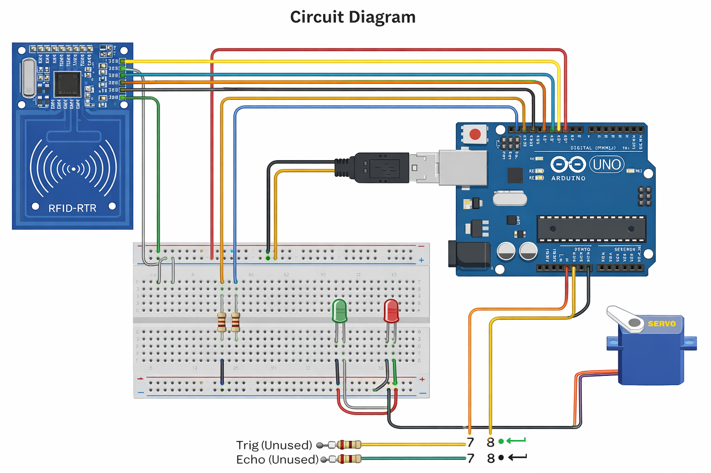

# 🔐 RFID Smart Lock System (Arduino)


A secure and efficient **RFID-based smart lock system** using Arduino. This project controls a servo motor lock using RFID authentication and provides LED feedback for access status.

---

## 📸 Project Preview


---

## 🚀 Features

* 🔑 RFID-based authentication
* 🔒 Servo motor lock/unlock mechanism
* ✅ Green LED for access granted
* ❌ Red LED for access denied
* ⚡ Fast response system
* 🧠 Anti-multiple scan (debounce logic)
* 💡 Beginner-friendly project

---

## 🛠️ Components Required

* Arduino Uno / Nano
* MFRC522 RFID Module
* Servo Motor (SG90)
* RFID Card/Tag
* Green LED
* Red LED
* 220Ω Resistors
* Breadboard & Jumper Wires

---

## 🔌 Circuit Diagram

```
RFID Module (MFRC522) → Arduino
--------------------------------
SDA (SS)  → Pin 10
SCK       → Pin 13
MOSI      → Pin 11
MISO      → Pin 12
RST       → Pin 9
GND       → GND
3.3V      → 3.3V

Servo Motor → Arduino
----------------------
Red (VCC)   → 5V
Brown (GND) → GND
Orange (Signal) → Pin 3

LED Connections
----------------
Green LED (+) → Pin 5 (via resistor)
Red LED (+)   → Pin 6 (via resistor)
LED (-)       → GND

Unused Pins (Reserved)
----------------------
Trig Pin → 7
Echo Pin → 8
```

---

## ⚙️ Working Principle

1. System initializes RFID module and servo motor.
2. User scans RFID card.
3. UID is read and compared.
4. If matched:

   * Servo unlocks (90°)
   * Green LED ON
5. If not matched:

   * Red LED ON
6. System resets automatically after delay.

---

## 🔑 Set Your RFID UID

Update this in code:

```cpp
byte validUID[4] = {0xA3, 0x67, 0x7C, 0x05};
```

To get UID:

* Open Serial Monitor
* Scan card
* Copy UID values

---

## 📦 Installation

1. Install Arduino IDE
2. Install Libraries:

   * MFRC522
   * SPI
   * Servo
3. Upload code
4. Open Serial Monitor (9600 baud)

---

## 🧠 Future Upgrades

* 🔊 Buzzer feedback
* 📟 OLED/LCD display
* 📶 IoT logging (ESP8266/ESP32)
* 🔢 Keypad backup system
* 👥 Multiple RFID support

---

## 📄 License

This project is licensed under the MIT License.

---

## 👨‍💻 Author

**Mayank Biswas**

---

## Demo

https://youtu.be/p05HAtv-6d0

----

## 🔌 Circuit Diagram



----

## ⭐ Support

If you like this project:

* ⭐ Star this repo
* 🍴 Fork it
* 📢 Share with others

---
